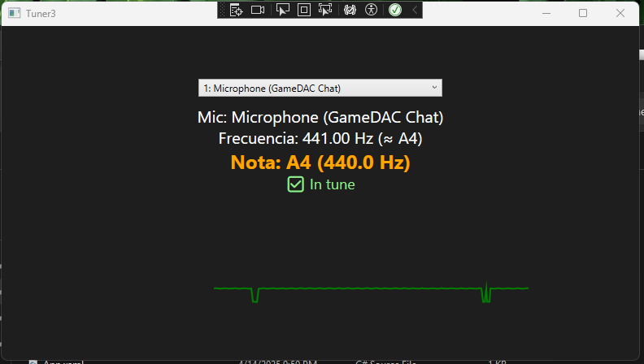

# 🎻 Tuner3 - Real-Time Instrument Tuner for Windows

**Tuner3** is a lightweight, real-time tuner for musical instruments, built in **C# and WPF** using the **NAudio** library. It captures sound from your microphone, analyzes the frequency, determines the closest musical note, and tells you whether you're in tune or not — all with a clean interface and a live visual graph.

## 🖼️ Screenshot



## ✨ Features

- ✅ **Real-time tuning** with microphone input
- 🎵 Displays the **detected frequency** and the **closest note**
- 🎯 Visual feedback: shows **"In Tune"** or **"Out of Tune"** based on pitch accuracy
- 📈 **Live frequency graph** that dynamically changes color:
  - 🟢 Green when in tune
  - 🔴 Red when out of tune
- 🎛 Allows selecting different microphones
- 🎧 Supports stereo input

## 🧠 How It Works

Tuner3 uses a basic **autocorrelation algorithm** to estimate pitch from audio input. It compares the detected frequency against standard musical note frequencies (A4 = 440Hz) and determines if you're playing accurately. The result is displayed both numerically and visually on a scrolling graph.

## 🧰 Requirements

- [Visual Studio 2022](https://visualstudio.microsoft.com/)
- [.NET 6.0 SDK or later](https://dotnet.microsoft.com/en-us/download)
- [NAudio NuGet package](https://www.nuget.org/packages/NAudio/)

## 🚀 Getting Started

1. Clone the repository:

   ```bash
   git clone https://github.com/moyinzunza/tuner3.git
   ```
